# MediConnect Analytics Lab

End-to-end Analytics Engineering project simulating the data stack of an eHealth marketplace.
Covers the full pipeline: synthetic data generation in Python, raw ingestion into BigQuery,
multi-layer dbt transformations, and BI-ready marts consumed by Looker Studio and a standalone
HTML dashboard. Tableau and Power BI specs are included as implementation references.

> **Live dashboard →** [MediConnect Analytics on Looker Studio](https://lookerstudio.google.com/reporting/bb506bc1-1e86-4688-afa9-4ff611f04085)

---

## Stack

| Layer | Tool |
|---|---|
| Data generation | Python 3.12 + Faker |
| Data warehouse | Google BigQuery (EU, partitioned + clustered) |
| Transformations | dbt Core 1.11 (BigQuery adapter) |
| BI | Looker Studio · standalone HTML (Tableau & Power BI specs) |
| CI | GitHub Actions (sqlfluff + dbt parse) |

---

## Dashboards

All dashboards connect exclusively to `dbt_marts` in BigQuery — no raw data, no ad-hoc queries.

### Looker Studio

| Page | Question answered |
|---|---|
| Executive Overview | Is the business growing? |
| Country Performance | Which markets perform best? |
| Specialty Performance | Which specialties generate most value? |
| Operations Quality | Where is the operational friction? |

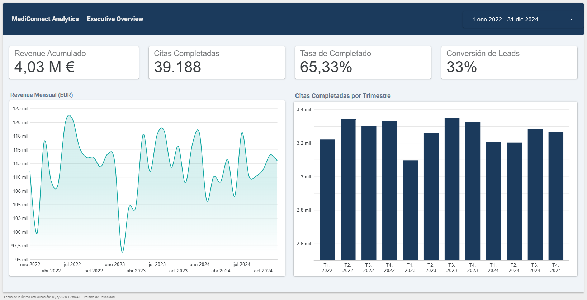
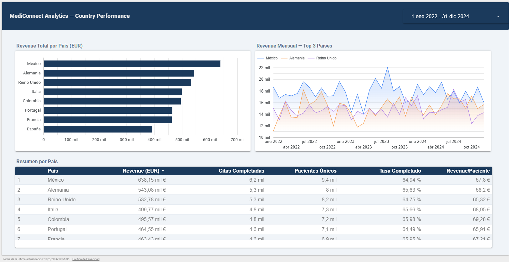
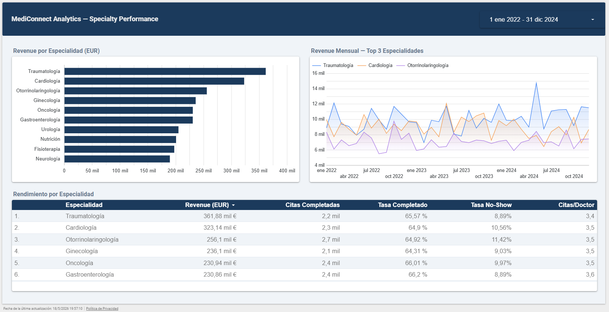
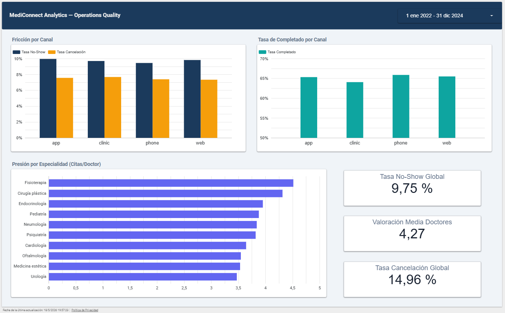

### Standalone HTML Dashboard

`dashboards/mediconnect_dashboard.html` is generated from BigQuery data via
`scripts/generate_html_dashboard.py`. Opens in any browser, no login required. Includes
the cohort retention heatmap (36 cohorts × 36 months).

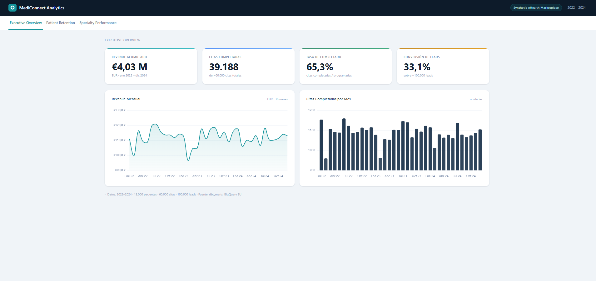
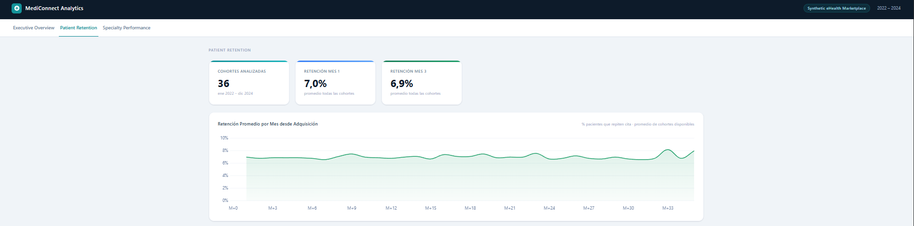
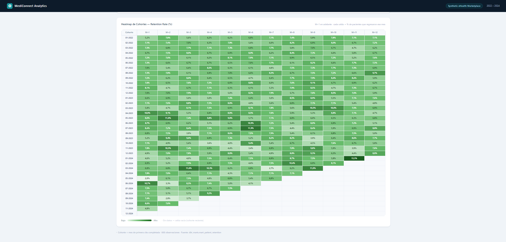
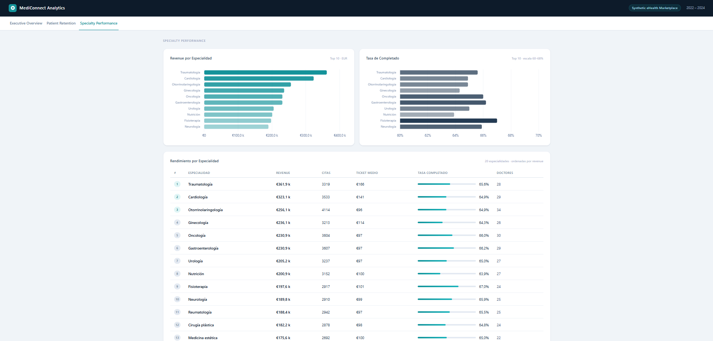

### Tableau & Power BI

Implementation specs, DAX measures, and calculated fields are in `dashboards/tableau/`
and `dashboards/powerbi/` as reference documentation.

---

## Project Structure

```
mediconnect-analytics-lab/
├── data/raw/                       # Generated CSVs (gitignored)
├── scripts/
│   ├── generate_synthetic_healthcare_data.py
│   ├── load_to_bigquery.py
│   ├── validate_source_data.py
│   ├── export_dashboard_extracts.py
│   └── generate_html_dashboard.py
├── sql_practice/                   # 00..10: smoke test, joins, CTEs,
│                                   # windows, BQ-specific, DQ, advanced,
│                                   # KPIs, patterns, optimisation, cost
├── dbt_mediconnect/
│   ├── models/
│   │   ├── staging/                # Views, 1:1 with raw sources
│   │   ├── intermediate/           # Views, enriched joins, business logic
│   │   └── marts/
│   │       ├── core/               # dim_* + fct_* (star schema)
│   │       ├── product/            # retention, quality, supply/demand
│   │       └── executive/          # daily/monthly/specialty KPIs
│   ├── snapshots/                  # SCD2 captures (e.g. snap_doctors)
│   ├── macros/
│   ├── tests/
│   ├── seeds/
│   └── analyses/
├── dashboards/
│   ├── mediconnect_dashboard.html  # Standalone HTML dashboard (generated)
│   ├── looker_studio/              # Screenshots + specs
│   ├── html/                       # HTML dashboard screenshots
│   ├── powerbi/                    # DAX measures + specs
│   └── tableau/                    # Calculated fields + specs
├── .github/workflows/              # dbt parse + sqlfluff lint on PRs
└── .env.example
```

---

## Data Model

**Raw sources** (`raw_mediconnect` dataset in BigQuery):
`specialties`, `countries`, `doctors`, `patients`, `appointments`, `payments`, `leads`.

**Star schema** (`dbt_marts` dataset):

```
dim_specialties ─┐
dim_countries   ─┤
dim_doctors     ─┼─> fct_appointments ─> fct_payments
dim_patients    ─┘             │
                               └─> fct_leads
```

**dbt lineage** (sources → staging → intermediate → marts):

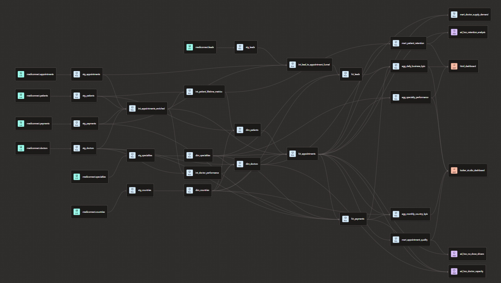

---

## Technical Evidence

| Evidence | Screenshot |
|---|---|
| BigQuery datasets (`raw_mediconnect` → `dbt_marts`) | 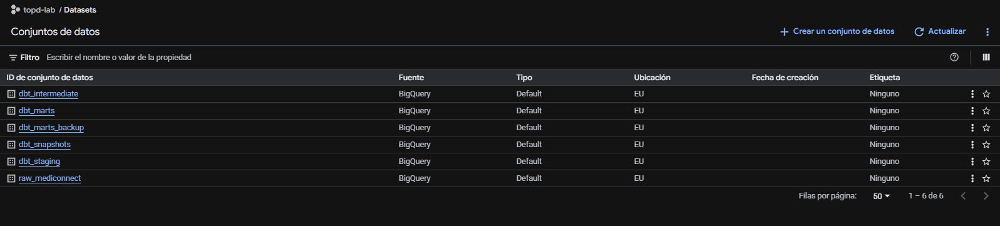 |
| `fct_appointments` schema — descriptions + PK/FK keys | 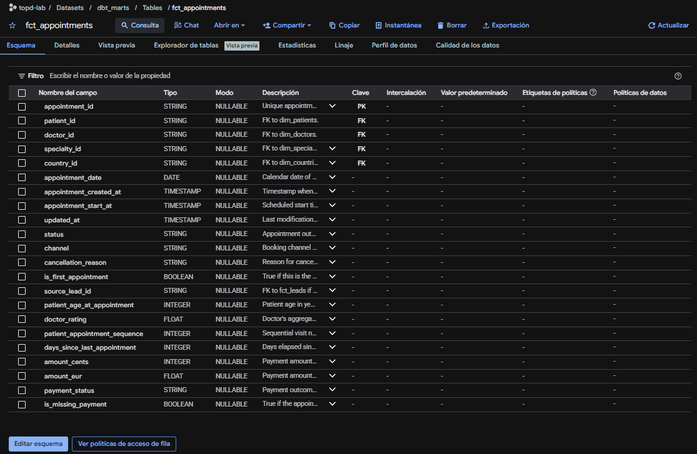 |
| `fct_appointments` — partition by month + clustering | 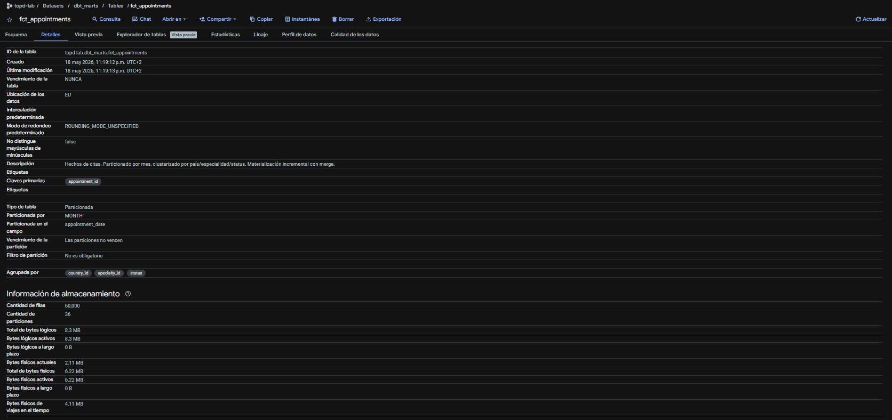 |
| Dry-run full scan (no partition filter) — 1.6 MB | 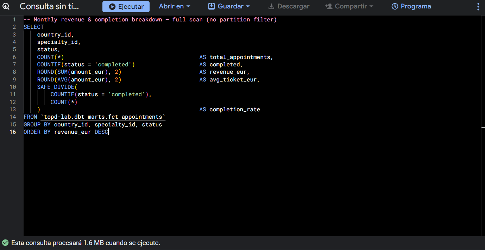 |
| Dry-run with partition filter (1 month) — 59 KB | 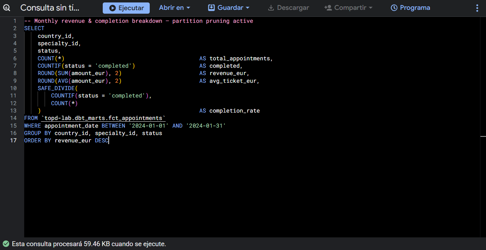 |

---

**Synthetic data volume** (3 years, Jan 2022 – Dec 2024):

| Table | Rows |
|---|---|
| patients | 15,000 |
| doctors | 500 |
| specialties | 20 |
| countries | 8 |
| appointments | 60,000 |
| payments | ~39,000 |
| leads | 100,000 |

The volumes are large enough to make partitioning, clustering, incremental
models and dashboard performance decisions matter.

---

## Setup

### 1. Python environment

```bash
python -m venv .venv
.venv\Scripts\activate          # Windows
pip install -r requirements.txt
cp .env.example .env            # Fill in GOOGLE_CLOUD_PROJECT and BQ_LOCATION
```

### 2. GCP Service Account

Required IAM roles (minimum privilege):

- `BigQuery Data Editor`
- `BigQuery Job User`
- `BigQuery Read Session User`

```bash
# Linux / macOS
export GOOGLE_APPLICATION_CREDENTIALS="/path/to/sa-key.json"

# Windows (PowerShell)
$env:GOOGLE_APPLICATION_CREDENTIALS="C:\path\to\sa-key.json"
```

### 3. Generate & load data

```bash
python scripts/generate_synthetic_healthcare_data.py
python scripts/load_to_bigquery.py
python scripts/validate_source_data.py
```

### 4. Run dbt

```bash
cd dbt_mediconnect
cp profiles.yml.example profiles.yml   # add your project_id and key path
dbt deps
dbt debug
dbt seed
dbt snapshot
dbt run
dbt test
```

To dev against a smaller slice of facts (last 90 days of the dataset):

```bash
dbt run --vars '{is_dev: true}'
```

### 5. Generate the standalone HTML dashboard

Queries `dbt_marts` in BigQuery and writes `dashboards/mediconnect_dashboard.html`:

```bash
python scripts/generate_html_dashboard.py
```

Opens in any browser, no login required. Delete the file and re-run the script at any
time to regenerate it from scratch.

---

## dbt Layers

### Staging (views)
Clean raw data: correct types, standardise column names, handle nulls.
One model per source table, no business logic.

### Intermediate (views)
Reusable business logic: enriched joins, window functions (ROW_NUMBER for visit
sequence, LAG for days between visits, RANK for doctor performance ranking),
and derived metrics that multiple marts consume.

### Marts Core (tables, partitioned + clustered)
Star schema: `dim_patients`, `dim_doctors`, `dim_specialties`, `dim_countries`,
`fct_appointments`, `fct_payments`, `fct_leads`.

`fct_appointments` is partitioned by `appointment_date` (MONTH) and clustered
by `[country_id, specialty_id, status]` for cost-efficient queries.

### Marts Product + Executive (tables)
`mart_patient_retention`, `mart_doctor_supply_demand`, `mart_appointment_quality`,
`agg_daily_business_kpis`, `agg_monthly_country_kpis`, `agg_specialty_performance`.

### Snapshots
`snap_doctors` captures slowly-changing attributes (`is_active`, `rating`) with
the `check` strategy, so historical state is preserved even if the source row
is updated in place.

---

## BigQuery Performance Decisions

| Decision | Implementation | Impact |
|---|---|---|
| Staging as views | `materialized='view'` in dbt | Zero storage cost, always fresh |
| Fact table partitioning | `fct_appointments` → `appointment_date` (MONTH) | Queries filtered by date scan only relevant partitions |
| Fact table clustering | `[country_id, specialty_id, status]` | Skips irrelevant blocks for high-cardinality filters |
| Dev variable | `is_dev: true` limits facts to last 90 days of data | Avoids full-table scans during local development |
| Explicit columns in CTEs | Staging and marts define columns explicitly in CTEs; no `SELECT *` from raw tables in marts | Prevents over-reading when schema evolves |

`fct_appointments` partition pruning example — a single-month filter scans roughly 1/36th of the
table compared to a full scan, an estimated ~97% cost reduction over the 3-year dataset
(verify with dry-run: `sql_practice/10_bigquery_cost_and_monitoring.sql` section 6).

Cost monitoring queries: `sql_practice/10_bigquery_cost_and_monitoring.sql`
covers `INFORMATION_SCHEMA.JOBS_BY_PROJECT`, daily spend, partition verification and dry-run estimation.

---

## CI

`.github/workflows/dbt-ci.yml` runs on every PR:

1. `dbt deps` and `dbt parse` against the project.
2. `sqlfluff lint` on `models/` and `sql_practice/` using the BigQuery dialect.

No BigQuery credentials needed: parse and lint are offline.

---

## Security

- Service account JSON key is gitignored (`*.json`).
- `.env` is gitignored, use `.env.example` as template.
- `data/raw/` gitignored, regenerate with the script.
- `profiles.yml` gitignored, use `profiles.yml.example` as template.
- Minimum IAM roles only, no BigQuery Admin, no Project Owner.
